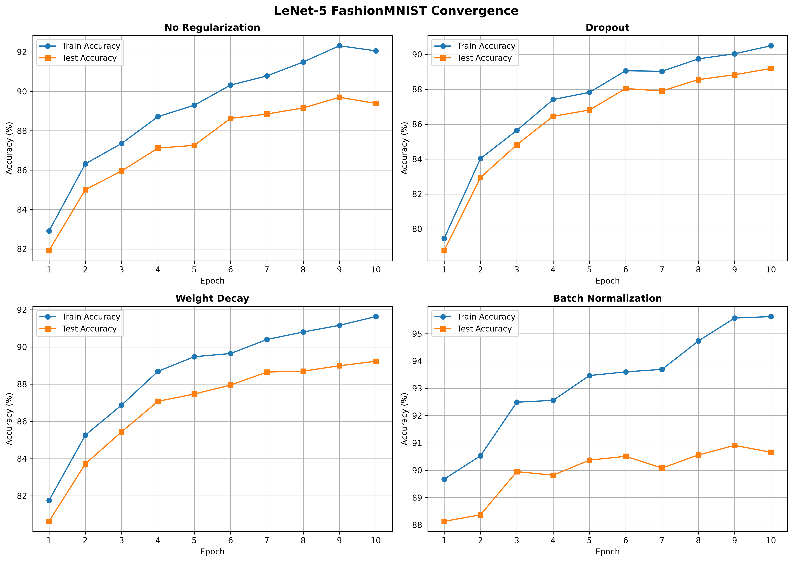

# CS5787 HW1 - LeNet-5 on FashionMNIST

## Overview

This project implements and trains a modified LeNet-5 convolutional neural network on the FashionMNIST dataset using PyTorch.

Four configurations are compared:

1. No Regularization
2. Dropout
3. Weight Decay
4. Batch Normalization

The goal is to compare how these techniques affect training accuracy, test accuracy, convergence behavior, and overfitting.


## Dataset

The FashionMNIST dataset contains:

- 60,000 training images
- 10,000 test images
- 10 classes
- Grayscale images of size 28 × 28

The original 60,000-image training set was randomly split into:

- 54,000 training samples
- 6,000 validation samples

A random seed of `42` was used for reproducibility.

The validation set was used for model selection. The test set was not used to select the best model.


## Model Architecture

The implementation uses a LeNet-5 architecture adapted for FashionMNIST's 28 × 28 grayscale images.

The base architecture is:

- Input: `1 × 28 × 28`
- Conv2D: `1 → 6` channels, kernel size `5 × 5`, padding `2`
- ReLU
- Average Pooling: `2 × 2`
- Conv2D: `6 → 16` channels, kernel size `5 × 5`
- ReLU
- Average Pooling: `2 × 2`
- Flatten: `16 × 5 × 5 = 400`
- Fully Connected: `400 → 120`
- ReLU
- Fully Connected: `120 → 84`
- ReLU
- Output Layer: `84 → 10`

The first convolutional layer uses padding so that the original LeNet-5 architecture can be adapted to FashionMNIST's 28 × 28 image dimensions.

ReLU activation is used throughout the hidden layers.

### No Regularization

The baseline configuration uses the standard modified LeNet-5 architecture without Dropout, Weight Decay, or Batch Normalization.

### Dropout

The Dropout configuration uses the same general LeNet-5 architecture with Dropout applied to the fully connected hidden layers.

The dropout probability is:

`p = 0.5`

During accuracy evaluation, the model is placed in evaluation mode using `model.eval()`. Therefore, Dropout is disabled when measuring both training and test accuracy.

### Weight Decay

The Weight Decay configuration uses the same architecture as the baseline model.

L2 regularization is applied through the optimizer using:

`weight_decay = 1e-4`

### Batch Normalization

The Batch Normalization configuration adds Batch Normalization layers to the convolutional and fully connected hidden layers.

PyTorch's Batch Normalization layers are used with their default settings.


## Training Settings

The following training settings were used:

- Batch size: `64`
- Learning rate: `0.001`
- Optimizer: `Adam`
- Epochs: `10`
- Loss function: Cross-Entropy Loss
- Dropout rate: `0.5`
- Weight decay: `1e-4`

The same main training settings were kept across all four experiments whenever possible so that the regularization methods could be compared fairly.

After each epoch, validation accuracy was computed.

The model checkpoint with the highest validation accuracy was saved and later used for final train and test evaluation.

The test set was not used for model selection.


## Hyperparameter Selection

A batch size of `64` was selected because it provides a reasonable balance between computational efficiency and stable gradient updates.

A learning rate of `0.001` was used with the Adam optimizer because it provides stable training for this model and dataset without requiring extensive manual learning-rate tuning.

All four configurations were trained for `10 epochs` so that their convergence behavior could be compared under the same training conditions.

For Dropout, a dropout probability of `0.5` was used. This provides moderate regularization in the fully connected hidden layers by randomly disabling some hidden units during training.

For Weight Decay, a coefficient of `1e-4` was used to apply L2 regularization without excessively restricting the model parameters.

For Batch Normalization, PyTorch's default Batch Normalization settings were used. Batch Normalization layers were inserted into the network to normalize intermediate activations during training.

The same settings were kept across experiments whenever possible to make the comparison between the four configurations fair.


## Training

Run the notebook from beginning to end:

`HW1.ipynb`

The notebook trains the following four configurations separately.

### 1. No Regularization

Uses the base LeNet-5 model without additional regularization.

The best model is saved as:

`lenet5_base.pth`

### 2. Dropout

Uses the Dropout version of LeNet-5 with:

`dropout_rate = 0.5`

The best model is saved as:

`lenet5_dropout.pth`

### 3. Weight Decay

Uses the base LeNet-5 architecture with Adam Weight Decay:

`weight_decay = 1e-4`

The best model is saved as:

`lenet5_weight_decay.pth`

### 4. Batch Normalization

Uses the Batch Normalization version of LeNet-5.

The best model is saved as:

`lenet5_batchnorm.pth`

For each configuration, validation accuracy is evaluated after every epoch.

The checkpoint with the highest validation accuracy is selected as the final model for that configuration.


## Saved Models

The following trained model checkpoints are generated:

- `lenet5_base.pth`
- `lenet5_dropout.pth`
- `lenet5_weight_decay.pth`
- `lenet5_batchnorm.pth`

The checkpoints store the learned model parameters for the best validation epoch of each experiment.


## Testing Saved Models

The saved checkpoints must be loaded using the corresponding model architecture.

| Checkpoint | Model |
|---|---|
| `lenet5_base.pth` | Base LeNet-5 |
| `lenet5_dropout.pth` | Dropout LeNet-5 |
| `lenet5_weight_decay.pth` | Base LeNet-5 |
| `lenet5_batchnorm.pth` | Batch Normalization LeNet-5 |

For example, the baseline model can be tested using:

```python
model = LeNet5Base().to(device)

model.load_state_dict(
    torch.load(
        "lenet5_base.pth",
        map_location=device
    )
)

test_accuracy = compute_accuracy(
    model,
    test_loader
)

print(f"Test Accuracy: {test_accuracy:.2f}%")
```

For the other configurations, instantiate the corresponding model architecture and load the appropriate `.pth` checkpoint.

The `compute_accuracy()` function places the model in evaluation mode using:

```python
model.eval()
```

This is especially important for the Dropout experiment because Dropout must be disabled when measuring training and test accuracy.


## Convergence Results

The following figure shows training and test accuracy over 10 epochs for all four LeNet-5 configurations.

Each subplot contains both the training and test accuracy curves for one configuration.



The x-axis represents the training epoch, and the y-axis represents classification accuracy.

There are eight accuracy curves in total:

- No Regularization: Train and Test
- Dropout: Train and Test
- Weight Decay: Train and Test
- Batch Normalization: Train and Test


## Selected Model Accuracy

The values below correspond to the checkpoint with the highest validation accuracy for each configuration.

Therefore, the reported accuracy does not necessarily correspond to the final training epoch.

| Technique | Best Epoch | Train Accuracy | Validation Accuracy | Test Accuracy |
|---|---:|---:|---:|---:|
| No Regularization | 9 | 92.32% | 90.02% | 89.70% |
| Dropout | 10 | 90.49% | 89.02% | 89.19% |
| Weight Decay | 9 | 91.16% | 89.50% | 88.99% |
| Batch Normalization | 9 | 95.57% | 91.13% | 90.91% |

All four configurations achieved more than 88% test accuracy.

The eight final train/test accuracies required for comparison are:

| Technique | Train Accuracy | Test Accuracy |
|---|---:|---:|
| No Regularization | 92.32% | 89.70% |
| Dropout | 90.49% | 89.19% |
| Weight Decay | 91.16% | 88.99% |
| Batch Normalization | 95.57% | 90.91% |


## Conclusion

All four LeNet-5 configurations achieved more than 88% test accuracy.

The No Regularization model achieved a test accuracy of **89.70%**, providing a baseline for comparison with the other techniques.

The Dropout model achieved **89.19%** test accuracy. It had the smallest difference between training and test accuracy among the four configurations, suggesting that Dropout reduced the amount of overfitting. However, its test accuracy was slightly lower than the baseline model under the selected hyperparameters.

The Weight Decay model achieved **88.99%** test accuracy. This was also slightly lower than the baseline result, indicating that the selected Weight Decay coefficient did not improve test performance in this experiment.

The Batch Normalization model achieved the highest validation accuracy at **91.13%** and the highest test accuracy at **90.91%**. Its training accuracy was also the highest at **95.57%**.

The convergence curves also show that Batch Normalization reached high accuracy relatively quickly during training.

Overall, Batch Normalization produced the highest predictive performance in this experiment, while Dropout produced the smallest gap between training and test accuracy. Weight Decay and Dropout provided regularization but did not outperform the baseline model with the selected hyperparameter values.

These results demonstrate that the different techniques affect LeNet-5 differently. Batch Normalization was the most effective for improving test accuracy in this experiment, while Dropout was useful for reducing the difference between training and test performance.


## Repository Files

```text
CS5787-HW1/
├── HW1.ipynb
├── README.md
├── lenet5_convergence.png
├── lenet5_base.pth
├── lenet5_dropout.pth
├── lenet5_weight_decay.pth
└── lenet5_batchnorm.pth
```
