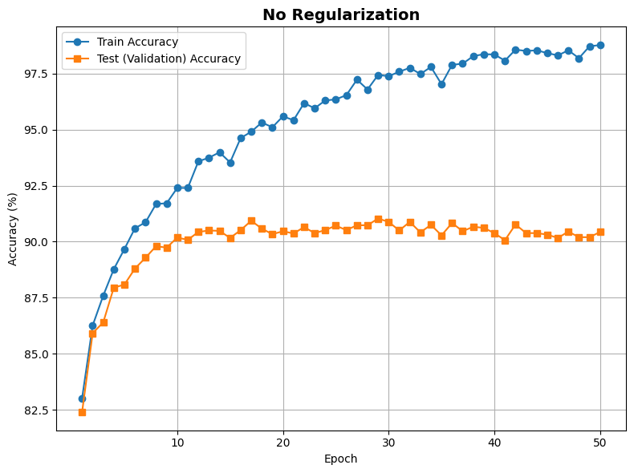
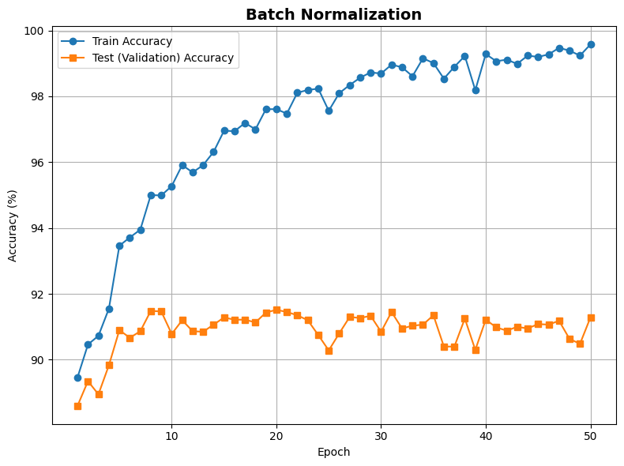
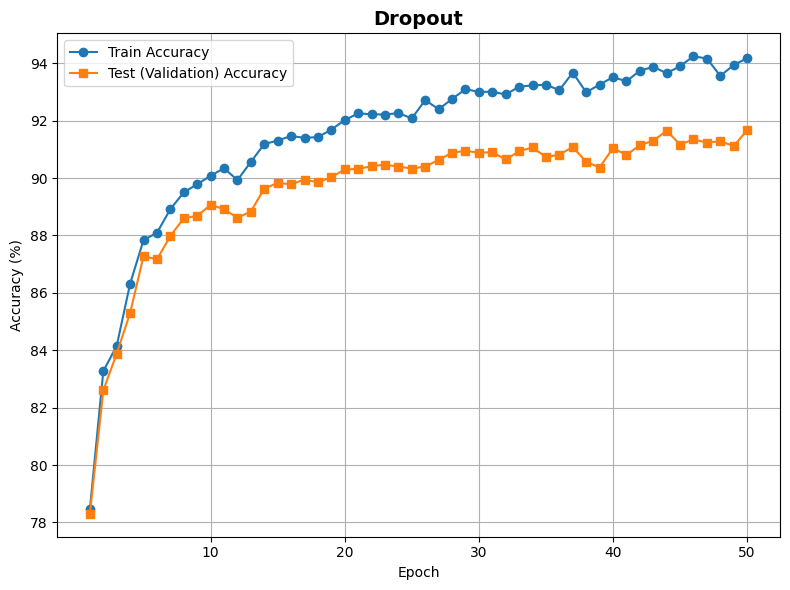
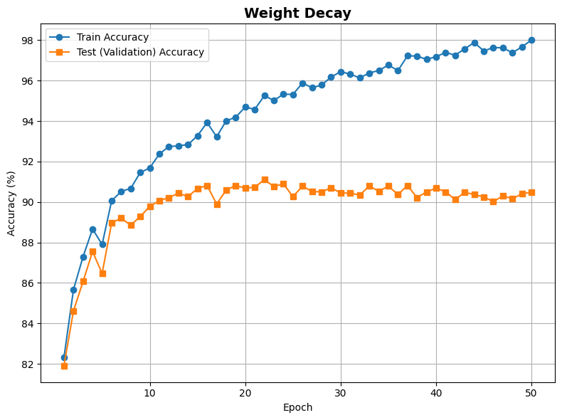

# CS5787 HW1 - LeNet-5 on FashionMNIST

## Overview

This project implements and trains a modified LeNet-5 convolutional neural network on the FashionMNIST dataset using PyTorch.

Four configurations are compared:

1. No Regularization
2. Dropout
3. Weight Decay
4. Batch Normalization

The goal is to compare how these techniques affect training accuracy, test accuracy, convergence behavior, and overfitting.


## Dataset

The FashionMNIST dataset contains:

- 60,000 training images
- 10,000 test images
- 10 classes
- Grayscale images of size 28 × 28

The original 60,000-image training set was randomly split into:

- 54,000 training samples
- 6,000 validation samples

A random seed of `42` was used for reproducibility.

The validation set was used for model selection. The test set was not used to select the best model.


## Model Architecture

The implementation uses a LeNet-5 architecture adapted for FashionMNIST's 28 × 28 grayscale images.

The base architecture is:

- Input: `1 × 28 × 28`
- Conv2D: `1 → 6` channels, kernel size `5 × 5`, padding `2`
- ReLU
- Average Pooling: `2 × 2`
- Conv2D: `6 → 16` channels, kernel size `5 × 5`
- ReLU
- Average Pooling: `2 × 2`
- Flatten: `16 × 5 × 5 = 400`
- Fully Connected: `400 → 120`
- ReLU
- Fully Connected: `120 → 84`
- ReLU
- Output Layer: `84 → 10`

The first convolutional layer uses padding so that the original LeNet-5 architecture can be adapted to FashionMNIST's 28 × 28 image dimensions.

ReLU activation is used throughout the hidden layers.

### No Regularization

The baseline configuration uses the standard modified LeNet-5 architecture without Dropout, Weight Decay, or Batch Normalization.

### Dropout

The Dropout configuration uses the same general LeNet-5 architecture with Dropout applied to the fully connected hidden layers.

The dropout probability is:

`p = 0.5`

During accuracy evaluation, the model is placed in evaluation mode using `model.eval()`. Therefore, Dropout is disabled when measuring both training and test accuracy.

### Weight Decay

The Weight Decay configuration uses the same architecture as the baseline model.

L2 regularization is applied through the optimizer using:

`weight_decay = 1e-4`

### Batch Normalization

The Batch Normalization configuration adds Batch Normalization layers to the convolutional and fully connected hidden layers.

PyTorch's Batch Normalization layers are used with their default settings.


## Training Settings

The following training settings were used:

- Batch size: `64`
- Learning rate: `0.001`
- Optimizer: `Adam`
- Epochs: `50`
- Loss function: Cross-Entropy Loss
- Dropout rate: `0.5`
- Weight decay: `1e-4`

The same main training settings were kept across all four experiments whenever possible so that the regularization methods could be compared fairly.

After each epoch, validation accuracy was computed.

The model checkpoint with the highest validation accuracy was saved and later used for final train and test evaluation.

The test set was not used for model selection.


## Hyperparameter Selection

Hyperparameters were selected through experiments over a range of candidate values. We tested learning rates of `0.01`, `0.001`, and `0.0001`, batch sizes of `64`, `128`, and `256`, and both `Adam` and `SGD` optimizers. For Weight Decay, coefficients of `1e-3` and `1e-4` were tested, while dropout probabilities of `0.3` and `0.5` were compared.

Based on the experimental results, a batch size of `64` and a learning rate of `0.001` achieved the best performance. The `Adam` optimizer was also selected based on the experimental comparison. A dropout probability of `0.5` and a Weight Decay coefficient of `1e-4` were selected for their respective configurations.

All four configurations were trained for `10 epochs` using the selected hyperparameters to ensure a fair comparison of their performance and convergence behavior. For Batch Normalization, PyTorch's default Batch Normalization settings were used.


## Training

Run the notebook from beginning to end:

`HW1.ipynb`

The notebook trains the following four configurations separately.

### 1. No Regularization

Uses the base LeNet-5 model without additional regularization.

The best model is saved as:

`lenet5_base.pth`

### 2. Dropout

Uses the Dropout version of LeNet-5 with:

`dropout_rate = 0.5`

The best model is saved as:

`lenet5_dropout.pth`

### 3. Weight Decay

Uses the base LeNet-5 architecture with Adam Weight Decay:

`weight_decay = 1e-4`

The best model is saved as:

`lenet5_weight_decay.pth`

### 4. Batch Normalization

Uses the Batch Normalization version of LeNet-5.

The best model is saved as:

`lenet5_batchnorm.pth`

For each configuration, validation accuracy is evaluated after every epoch.

The checkpoint with the highest validation accuracy is selected as the final model for that configuration.


## Saved Models

The following trained model checkpoints are generated:

- `lenet5_base.pth`
- `lenet5_dropout.pth`
- `lenet5_weight_decay.pth`
- `lenet5_batchnorm.pth`

The checkpoints store the learned model parameters for the best validation epoch of each experiment.


## Testing Saved Models

The saved checkpoints must be loaded using the corresponding model architecture.

| Checkpoint | Model |
|---|---|
| `lenet5_base.pth` | Base LeNet-5 |
| `lenet5_dropout.pth` | Dropout LeNet-5 |
| `lenet5_weight_decay.pth` | Base LeNet-5 |
| `lenet5_batchnorm.pth` | Batch Normalization LeNet-5 |

For example, the baseline model can be tested using:

```python
model = LeNet5Base().to(device)

model.load_state_dict(
    torch.load(
        "lenet5_base.pth",
        map_location=device
    )
)

test_accuracy = compute_accuracy(
    model,
    test_loader
)

print(f"Test Accuracy: {test_accuracy:.2f}%")
```

For the other configurations, instantiate the corresponding model architecture and load the appropriate `.pth` checkpoint.

The `compute_accuracy()` function places the model in evaluation mode using:

```python
model.eval()
```

This is especially important for the Dropout experiment because Dropout must be disabled when measuring training and test accuracy.


## Convergence Results

The following figures show training and test (Validation) accuracy over 50 epochs for all four LeNet-5 configurations.






The x-axis represents the training epoch, and the y-axis represents classification accuracy.

There are eight accuracy curves in total:

- No Regularization: Train and Test
- Dropout: Train and Test
- Weight Decay: Train and Test
- Batch Normalization: Train and Test


## Selected Model Accuracy

The values below correspond to the checkpoint with the highest validation accuracy for each configuration.

Therefore, the reported accuracies correspond to the selected best-validation checkpoint and do not necessarily represent the final training epoch.

| Technique | Best Epoch | Train Accuracy | Validation Accuracy | Test Accuracy |
|---|---:|---:|---:|---:|
| No Regularization | 29 | 97.44% | 91.03% | 90.49% |
| Dropout | 50 | 94.18% | **91.67%** | 90.65% |
| Weight Decay | 22 | 95.26% | 91.10% | **90.98%** |
| Batch Normalization | 20 | **97.61%** | 91.52% | 90.64% |

All four configurations achieved more than 90% test accuracy.

Dropout achieved the highest validation accuracy at **91.67%**, while Weight Decay achieved the highest test accuracy at **90.98%**.

The eight selected train/test accuracies required for comparison are:

| Technique | Train Accuracy | Test Accuracy |
|---|---:|---:|
| No Regularization | 97.44% | 90.49% |
| Dropout | 94.18% | 90.65% |
| Weight Decay | 95.26% | 90.98% |
| Batch Normalization | 97.61% | 90.64% |

## Conclusion

All four LeNet-5 configurations achieved more than 90% test accuracy on the FashionMNIST dataset.

The No Regularization model achieved a test accuracy of **90.49%**, providing a baseline for comparison with the other techniques.

The Dropout model achieved **90.65%** test accuracy and the highest validation accuracy of **91.67%**. It also had the smallest difference between training accuracy (94.18%) and test accuracy (90.65%) among the four configurations. This suggests that Dropout was effective at reducing overfitting and improving generalization compared with the baseline.

The Weight Decay model achieved the highest test accuracy of **90.98%**, compared with the baseline test accuracy of 90.49%. This indicates that the selected Weight Decay coefficient slightly improved test performance in this experiment.

The Batch Normalization model achieved **91.52%** validation accuracy and **90.64%** test accuracy. It also reached the highest training accuracy of **97.61%**. Its test performance was similar to the other models, although the difference between its training and test accuracy was larger than that of Dropout and Weight Decay.

Overall, **Weight Decay achieved the highest test accuracy, while Dropout achieved the highest validation accuracy and the smallest training-test accuracy gap**. The differences in test accuracy among all four configurations were relatively small, with all models achieving approximately 90–91% test accuracy.

These results show that the different techniques affect LeNet-5 in different ways. Weight Decay provided the best final test performance in this experiment, while Dropout provided the strongest regularization effect based on the smaller gap between training and test accuracy.


## Repository Files

```text
CS5787-HW1/
├── HW1.ipynb
├── README.md
├── lenet5_convergence.png
├── lenet5_base.pth
├── lenet5_dropout.pth
├── lenet5_weight_decay.pth
└── lenet5_batchnorm.pth
```


## Generative AI Usage

ChatGPT was used to help clarify concepts, debug code, and improve the organization and wording of the README. The final implementation and experimental results were produced and verified by the authors.

